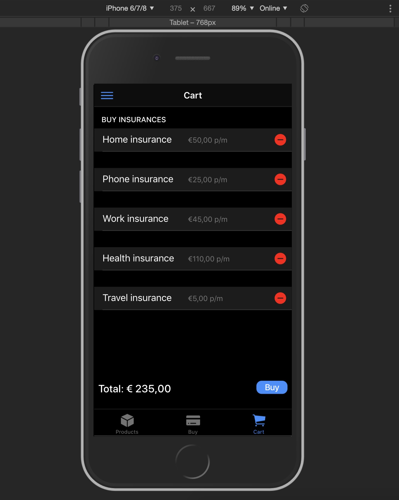
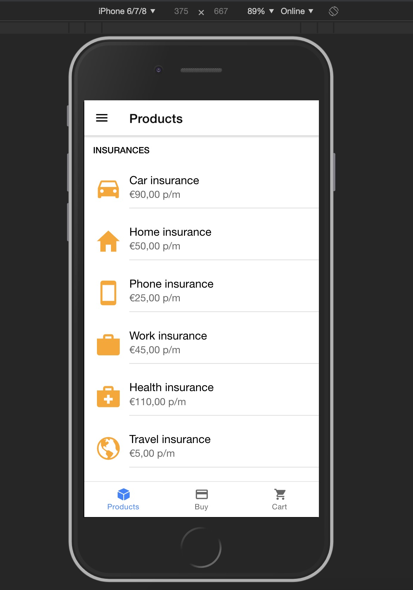
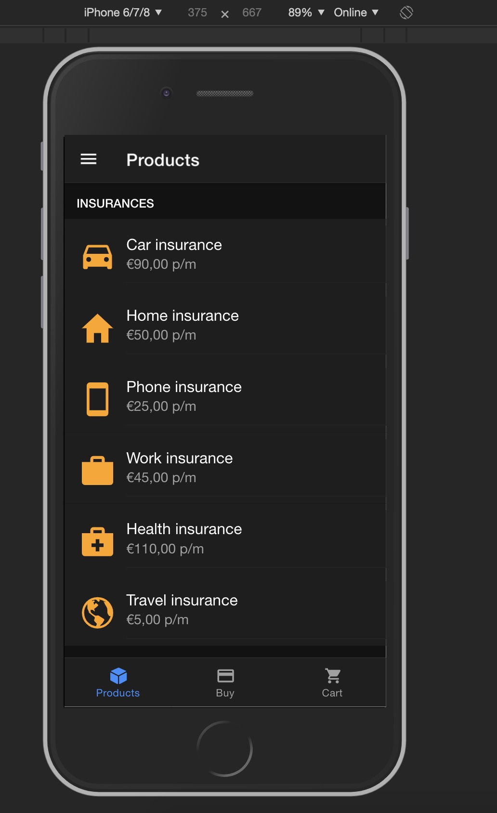

<h1 align="center">

IONIC INSURANCES APP
</h1>


This app demonstrates the harmonical coexistence of IONIC4+, NGRX8+, ANGULAR8+. It contains a normal and a <b style='color:red'>Dark Mode</b>!!


[Setup and install](#setup-and-install) | [Preview](#app-preview) | [Tasks](#tasks) |
[Resources](#resources)

## Setup and install

Clone this repo from inside GitHub  or
simply download the `.zip` bundle with the contents inside.

## Dependency installation

Download the installer for Node.js 6 or greater.
Install the ionic CLI globally: npm install -g ionic
Clone this repository

```
cd <insurances-app>
yarn install
# OR
npm install
```

This will then setup all the development and production dependencies we need.

## Tasks

A quick reminder of all tasks available:

Now simply run this to boot up the server:

## Development server

```
ionic serve -b --no-livereload

```

Visit `localhost:8100` to start building.

## Running unit tests
Run `yarn test` to execute the unit tests via Karma.


## App Preview
check out the screenshots directory!(especially the <b style='color:red'>Dark Mode</b>)


- [Cart Page Dark](https://github.com/nis24jit/ionic-insurances-app/blob/master/resources/screenshots/Darkmode.jpg)

  
  
- [Home Page](https://github.com/nis24jit/ionic-insurances-app/blob/master/resources/screenshots/Products_home.jpg)

  
  
  
 - [Home Page Dark](https://github.com/nis24jit/ionic-insurances-app/blob/master/resources/screenshots/Products_home_dark.jpg)
  
    
    
  
check out the [screenshots directory](https://github.com/nis24jit/ionic-insurances-app/tree/master/resources/screenshots) for more


## Deploying

Run npm run ionic:build --prod

Push the www folder to your hosting service

### Android
Run ionic cordova run android --prod

### iOS
Run ionic cordova run ios --prod


## Resources

The app would not have been made possible if not for the below resources

* [Ionic](https://ionicframework.com/docs)
* [Angular](https://angular.io)
* [ngrx/store](https://github.com/ngrx/platform/blob/master/docs/store/README.md)
  docs
* [ngrx/effects](https://github.com/ngrx/platform/blob/master/docs/effects/README.md)
  docs
* [yarn](https://yarnpkg.com)
* [npm](https://www.npmjs.com/)
* [Webpack](https://webpack.js.org/)
